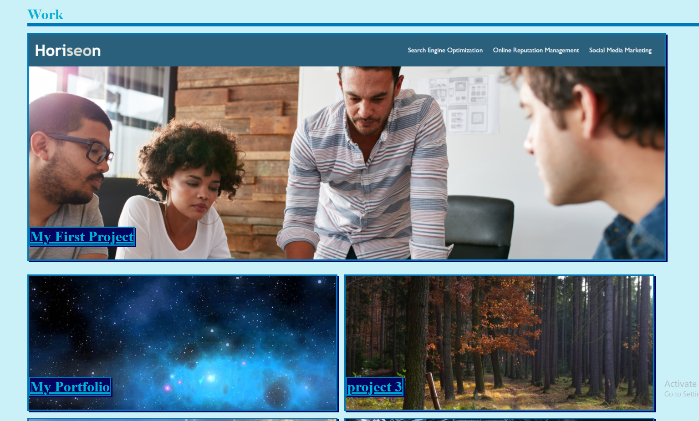

# hw2-portfolio

## The Task
    The task was to create a funstioning portfolio page to feture me and the application that I have worked on. with funcioning links and jump buttons in the nav bar at the top. 

## The Project

    This project was a lot of fun to work on it really pushed my skills as a beginner. Working with flexbox to make it work the way I wanted it to work was a challenge but once I got the hang of it I was easily able to use it on the rest of the page. another challenge for was having the page look good on all screen types, I think I got it to look good on most screen sizes. I didnt have many projects to link to for this portfolio so I just used placeholder names and images instead but I still linked to a github repo for all of them which can easily be updated once I have more projects to add to the portfolio in the future.

    link to the deployable website: https://brettfleming.github.io/hw2-portfolio/

    image of the work section of the project 

 